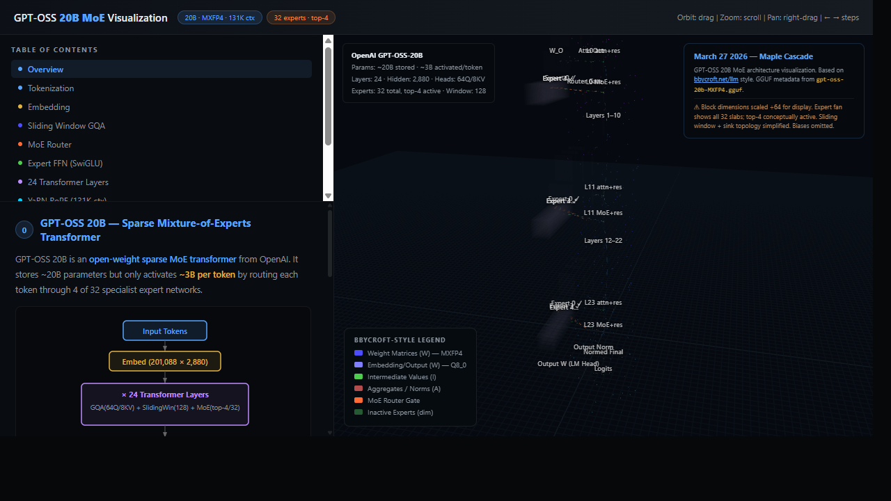

# GPT-OSS 20B — Interactive Architecture Visualization

**April 1, 2026 — Maple Cascade**

## [🚀 Try it live → maplecascade.github.io/gpt-oss-20b-viz](https://maplecascade.github.io/gpt-oss-20b-viz/)

   

Interactive 3D visualization of the GPT-OSS 20B Mixture-of-Experts language model architecture, inspired by [bbycroft.net/llm](https://bbycroft.net/llm). All dimensions and tensor shapes are fact-checked directly against the GGUF model metadata (`attention.key_length`, `attention.value_length`, `expert_count`, etc.).

## Architecture at a Glance

| Property | Value |
|---|---|
| Parameters | ~20B (sparse MoE) |
| Layers | 24 transformer blocks |
| Hidden dim | 2,880 |
| Attention | Grouped-Query (64Q / 8KV heads, head_dim=64) |
| Sliding window | 128 tokens |
| Experts | 32 total, top-4 active per token |
| Expert FFN dim | 2,880 (SwiGLU gate+up+down) |
| Context length | 131,072 tokens (YaRN 32× from 4,096) |
| Vocabulary | 201,088 tokens (GPT-4o tokenizer) |
| Quantization | MXFP4 (weights), Q8_0 (embedding/output) |

## Features

- **Fully 3D** — orbit, zoom, pan with mouse / touch
- **Step-by-step walkthrough** — 9 annotated steps covering tokenization → embedding → GQA attention → MoE routing → YaRN RoPE → output
- **Accurate block proportions** — tensor shapes derived from GGUF metadata, scaled for display (÷64 cells)
- **Bycroft-style animated flow arrows** — dashed tubes with traveling dots show data flow through residual stream
- **QKV layers** — Q / K / V projections shown as z-stacked weight + activation pairs matching their 64-d / 512-d proportions
- **32 Expert slabs** — spread in Z-depth, top-4 active highlighted, inactive faded
- **Sliding window attention mask** — interactive canvas showing window=128 + sink tokens
- **YaRN RoPE canvas** — per-dimension wavelength chart, 64-dim head, θ=150,000
- **Token flow demo** — step-through token generation with expert routing scores

## Verified Against GGUF Metadata

All key shapes were confirmed with `gguf_dump.py --no-tensors` on the `gpt-oss-20b-MXFP4.gguf` file:

| GGUF Key | Value | Viz |
|---|---|---|
| `attention.key_length` | 64 | ✓ |
| `attention.value_length` | 64 | ✓ |
| `attention.head_count` | 64 | ✓ |
| `attention.head_count_kv` | 8 | ✓ |
| `attention.sliding_window` | 128 | ✓ |
| `expert_count` | 32 | ✓ |
| `expert_used_count` | 4 | ✓ |
| `rope.freq_base` | 150,000 | ✓ |
| `rope.scaling.factor` | 32× | ✓ |
| `tokenizer.ggml.bos_token_id` | 199,998 | ✓ |
| `tokenizer.ggml.eos_token_id` | 200,002 | ✓ |

## Usage

Open [the live page](https://maplecascade.github.io/gpt-oss-20b-viz/) — no install needed. Everything runs client-side in WebGL via Three.js.

- **Click** any block → tooltip with shape, quant type, and section highlight
- **Step buttons** (left panel) → camera pans to that layer, info panel updates
- **Orbit** → left-click drag; **Zoom** → scroll; **Pan** → right-click drag
